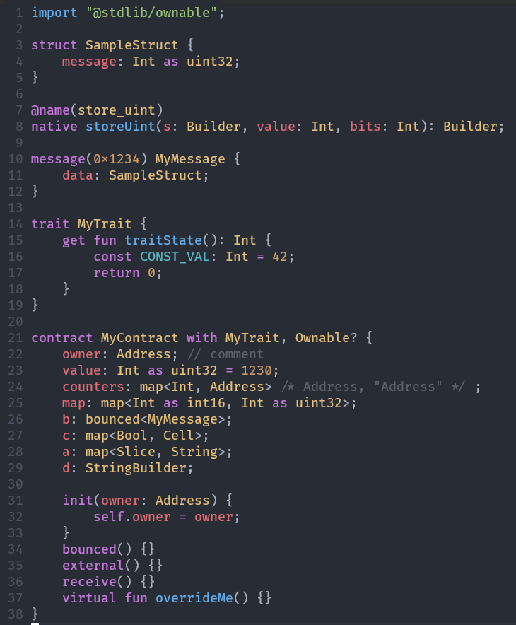

# tact.vim

<center>
  
</center>

🚀 Adds syntax highlighting, grammar completion, and miscellaneous support for the [Tact programming language](https://tact-lang.org/) to Vim 8+ and Neovim.

⚡ Tact is a new programming language for TON blockchain focused on efficiency and simplicity. It is designed to be easy to learn and use and to be a good fit for smart contracts because it is a statically typed language with a simple syntax and a powerful type system.

## Features

- [Syntax highlighting](#highlighting), which closely follows Tact specification in its [Ohm grammar file](https://github.com/tact-lang/tact/blob/main/src/grammar/grammar.ohm)
- [Indentation](#indentation), as well as single-line and multi-line comments support
- [Basic indentation & folding support](#folding)
- [Compiler integration support](#usage)
- [Abbreviations](#abbreviations) in INSERT mode
- [Auto-completion](#completion) (omnifunc/completefunc) support of static (global) and extension (methods on types) functions from stdlib, and all of the basic grammar \
  (use `ctrl-x ctrl-o` to trigger it or set shortcuts as you wish)
- Basic linting, which automatically triggers on omnicompletion. Don't forget to close your braces {}, parenthesis (), and names, or use keyword completion instead ;)

See the highlighting showcase below (uses the `One Dark` color scheme).\
Note, that you can [disable highlighting of identifiers](#highlighting), if you want to :)



## Installation

<!--

### First time in Vim 8+? Read this!

<details>
<summary><em>Click to see</em></summary>

Assuming you don't have any configuration in the `.vimrc` file, setting up some sane defaults is nicer before using this (or any other) plugin. Also, the following mini-guide will use the built-in package management for Vim 8+ and won't introduce anything fancy.

Steps:
1. Get yourself a Vim of version 8+ installed and make sure to have git installed and present on your path as well
2. Create a `~/.vimrc` file (or `~/_vimrc` if you're on Windows)
3. Without such a file, there were sourced defaults by the Vim authors, but once it's created, we have to put them back explicitly by adding those lines in and saving changes <kbd>:w</kbd>:

```vim
unlet! skip_defaults_vim
source $VIMRUNTIME/defaults.vim
```

4. While here, let's add some `tact. vim'- specific stuff. This time save and quit as we no longer need to add anything (<kbd>:wq</kbd>):

```vim
let g:tact_style_guide = 1  " Enabling default indentation style

" the following is optional and added purely for your convenience:
inoremap <silent> <c-space> <c-x><c-o>  " Open completion menu on ctrl-space
```

Note: on macOS, the `<c-space>` is already bound in the system, so unless the terminal intercepts it, you'll have to use a different keybinding.

5. It's also nice to source in the extended defaults provided by the [tpope/vim-sensible](https://github.com/tpope/vim-sensible). To do so, let's use the built-in package manager:

On Linux, macOS or *BSD:

```bash
git clone "https://github.com/tpope/vim-sensible.git" ~/.vim/pack/tpope/start/sensible
```

On Windows, do this in PowerShell:

```powershell
git clone 'https://github.com/tpope/vim-sensible.git' $HOME\vimfiles\pack\tpope\start\sensible
```

6. Finally, let's install ⚡ [tact.vim](https://github.com/tact-lang/tact.vim):

On Linux, macOS or *BSD:

```bash
git clone "https://github.com/tact-lang/tact.vim.git" ~/.vim/pack/tact-lang/start/tact
vim -u NONE -c "helptags $HOME/.vim/pack/tact-lang/start/tact/doc" -c q
```

On Windows, do this in PowerShell:

```powershell
git clone 'https://github.com/tact-lang/tact.vim.git' $HOME\vimfiles\pack\tact-lang\start\tact
vim -u NONE -c 'helptags $HOME\vimfiles\pack\tact-lang\start\tact\doc' -c q
```

7. Start the Vim in the [valid Tact project](https://docs.tact-lang.org/) to use the `:Tact` command for easy compilation or otherwise provide any `.tact` file. Happy coding 🚀

</details>

### Built-in package manager in Vim 8+

<details>
<summary>Click to see</summary>

It is the recommended installation method if you use at least Vim 8 and you don't use another package manager.
More about Vim's built-in package manager: [`:help packages`](https://vimhelp.org/repeat.txt.html#packages).

For Linux/macOS:

```sh
git clone "https://github.com/tact-lang/tact.vim.git" ~/.vim/pack/tact-lang/start/tact
vim -u NONE -c "helptags $HOME/.vim/pack/tact-lang/start/tact/doc" -c q
```

For Windows/PowerShell:

```powershell
git clone 'https://github.com/tact-lang/tact.vim.git' $HOME\vimfiles\pack\tact-lang\start\tact
vim -u NONE -c 'helptags $HOME\vimfiles\pack\tact-lang\start\tact\doc' -c q
```

Don't forget to restart Vim after :)

</details>

-->

### via Vundle

<details>
<summary>Click to see</summary>

Info about it: [Vundle repository](https://github.com/VundleVim/Vundle.vim).

Steps:
1. Add `tact.vim` to your plugin list in `~/.vimrc` (or `~/_vimrc` on Windows) by inserting
   the line that starts with `Plugin`:

   ```vim
   call vundle#begin()
     " ...
     Plugin 'tact-lang/tact.vim'
     " ...
   call vundle#end()
   ```

2. Restart Vim or run `:source ~/.vimrc`.
3. Run `:PluginInstall`.

</details>

### via vim-plug

<details>
<summary>Click to see</summary>

Info about it: [vim-plug repository](https://github.com/junegunn/vim-plug).

Steps:
1. Add `tact.vim` to your plugin list in `~/.vimrc` (or `~/_vimrc` on Windows) by inserting
   the line that starts with `Plug`:

   ```vim
   call plug#begin()
     "...
     Plug 'tact-lang/tact.vim'
     "...
   call plug#end()
   ```

2. Restart Vim or run `:source ~/.vimrc`.
3. Run `:PlugInstall`.

</details>

### via lazy.nvim (Neovim-only)

<details>
<summary>Click to see</summary>

Info about it:
- [lazy.nvim repository](https://github.com/folke/lazy.nvim).
- [Installation of lazy.nvim](https://github.com/folke/lazy.nvim#-installation)

Steps:
1. Add `tact.vim` to your lazy.nvim setup in `~/.config/nvim/init.lua` (or `~/AppData/Local/nvim/init.lua` on Windows):

   ```lua
    require('lazy').setup({
      -- ...
      { 'tact-lang/tact.vim' },
      -- ...
    }, {})
   ```
2. Run `:Lazy`.

</details>

### Language Server

In addition, it's strongly recommended that a Tact language server be installed and set up.

Get an official one here: [tact-language-server](https://github.com/tact-lang/tact-language-server).

## Configuration

### Completion

By default this plugin sets an `omnifunc` option to provide auto-completions by triggering <kbd>CTRL-x</kbd><kbd>CTRL-o</kbd> in INSERT mode. However, if you're using an LSP client for Tact language, it may overwrite this option and turn off the completion and basic linting capabilities provided by this plugin alongside it.

To prevent that behavior, you may want to bind the completion features of this plugin to a `competefunc` option (which is quite conveniently triggered by <kbd>CTRL-x</kbd><kbd>CTRL-u</kbd> in INSERT mode). Add the following to your `~/.vimrc` (or `~/_vimrc` on Windows) if you'd like to prefer and bind `completefunc` over `omnifunc`:

```vim
" CTRL-x CTRL-u instead of CTRL-x CTRL-o
let g:tact_prefer_completefunc = 1
```

<details>
<summary>Neovim-only</summary>

```lua
vim.g.tact_prefer_completefunc = 1
```

Alternatively, add the following to the `init` key of your `lazy.nvim` config:

```lua
require('lazy').setup({
  -- ...
  {
    'tact-lang/tact.vim',
    init = function()
      -- ...
      vim.g.tact_prefer_completefunc = 1
      -- ...
    end,
  },
  -- ...
}, {})
```

</details>

### Indentation

Add the following to your `~/.vimrc` (or `~/_vimrc` on Windows) to enable the preferred indentation style for Tact:

```vim
let g:tact_style_guide = 1
```

<details>
<summary>Neovim-only</summary>

```lua
vim.g.tact_style_guide = 1
```

Alternatively, add the following to the `init` key of your `lazy.nvim` config:

```lua
require('lazy').setup({
  -- ...
  {
    'tact-lang/tact.vim',
    init = function()
      -- ...
      vim.g.tact_style_guide = 1
      -- ...
    end,
  },
  -- ...
}, {})
```

</details>

### Highlighting

If you want to turn off highlighting of identifiers: variables, and constants (but not structures), add the following option:

```vim
let g:tact_blank_identifiers = 1
```

<details>
<summary>Neovim-only</summary>

```lua
vim.g.tact_blank_identifiers = 1
```

Alternatively, add the following to the `init` key of your `lazy.nvim` config:

```lua
require('lazy').setup({
  -- ...
  {
    'tact-lang/tact.vim',
    init = function()
      -- ...
      vim.g.tact_blank_identifiers = 1
      -- ...
    end,
  },
  -- ...
}, {})
```

</details>

To turn off highlighting of structures (names of traits, messages, contracts, and structs), add the following:

```vim
let g:tact_blank_structures = 1
```

<details>
<summary>Neovim-only</summary>

```lua
vim.g.tact_blank_structures = 1
```

Alternatively, add the following to the `init` key of your `lazy.nvim` config:

```lua
require('lazy').setup({
  -- ...
  {
    'tact-lang/tact.vim',
    init = function()
      -- ...
      vim.g.tact_blank_structures = 1
      -- ...
    end,
  },
  -- ...
}, {})
```

</details>

### Formatting

A series of Vim motions can do basic code formatting: `gg=G` (plus <kbd>Ctrl-o</kbd> twice to return to the original cursor position) or by invoking a `:TactFmt` command, which does all that for you *without* messing up with your cursor. Use both with caution, as Vim-native indentation handling is known to be prone to errors.

### Folding

To enable code-folding, add the following snippet. This one might have an impact on editing performance; proceed with
caution:

```vim
augroup tact_folding
    au!
    au FileType tact setlocal foldmethod=syntax
augroup END
```

<details>
<summary>Neovim-only</summary>

Make a `~/.config/nvim/after/ftplugin` directory (`~/AppData/Local/nvim/after/ftplugin`) and put the file `tact.lua` in it with the following contents:

```lua
vim.opt.foldmethod = "syntax"
vim.opt.foldenable = false  -- turn off automatic folding on file opening
```

</details>

### Abbreviations

To trigger an abbreviation, type it in followed by punctuation such as a space or comma, and it will expand into a code snippet. It's advised to use space for this, as it usually produces the best results.

These abbreviations (and auto-completions of their names) are available right away:

1. `a_fun` — expands to the function declaration
1. `a_extfun` — expands to the extension function declaration
1. `a_mutfun` — expands to the mutable function declaration
1. `a_natfun` — expands to the native function declaration
1. `a_co` — expands to the contract declaration
1. `a_tr` — expands to the trait declaration
1. `a_st` — expands to the struct declaration
1. `a_me` — expands to the message declaration
1. `a_se` — expands to send(SendParameters{...}) call

**Keep in mind** that abbreviations are always there, and you can always type them in, even if they're not shown by omnicompletion when deemed unsuitable for the current completion context.

To avoid expansion in INSERT mode, type Ctrl-V after the last character of the abbreviation (on Windows, type Ctrl-Q instead of Ctrl-V).

To completely disable abbreviations provided by this plugin only, add this to your `~/.vimrc` (or `~/_vimrc` on Windows):

```vim
let g:tact_disable_abbreviations = 1
```

<details>
<summary>Neovim-only</summary>

```lua
vim.g.tact_disable_abbreviations = 1
```

Alternatively, add the following to the `init` key of your `lazy.nvim` config:

```lua
require('lazy').setup({
  -- ...
  {
    'tact-lang/tact.vim',
    init = function()
      -- ...
      vim.g.tact_disable_abbreviations = 1
      -- ...
    end,
  },
  -- ...
}, {})
```

</details>

### Linting

Simply run the `:Tact` command to try compiling using Tacts' compiler and look for errors. See the [Usage section](#usage) for more info on the command.

### Miscellaneous

For the ease of omnicompletion usage, you may want to add this or similar bindings, but they are not obligatory to use the plugin:

```vim
" Open omnicompletion menu on ctrl-space
inoremap <silent> <c-space> <c-x><c-o>
```

<details>
<summary>Neovim-only</summary>

```lua
vim.keymap.set('i', '<c-space>', '<c-x><c-o>', { noremap = true, silent = true})
```

</details>

Note that on macOS, there's a default system-wide keyboard shortcut for <kbd>Ctrl</kbd><kbd>Space</kbd> (`^space`). You may want to change it to <kbd>Cmd</kbd><kbd>Space</kbd> instead or use the different binding in Vim.

At times when omnicompletion (<kbd>CTRL-x</kbd><kbd>CTRL-o</kbd>) can't complete much it fallbacks to keyword completion (<kbd>CTRL-x</kbd><kbd>CTRL-n</kbd>). But that's not always the case, so if omnicompletion doesn't show anything, try keyword one!

## Usage

For your convenience, a `:Tact` command is available whenever you open any `.tact` files. It tries to run the `build` script from your `package.json` project file, which, as shown in [this official example here](https://docs.tact-lang.org/start#getting-started-from-scratch), should invoke a Tact compiler. You're expected to have a Node.js of the current LTS (or later) version installed on your system, alongside `npm` for the `:Tact` command to work.

It's generally recommended that you go over the [example](https://docs.tact-lang.org/start#getting-started-from-scratch), which shows how to get started with Tact.
Alternatively, use the [official project template](https://github.com/tact-lang/tact-template ): either copy it or create a new repository based on it.

We wish you good luck and fun exploring Tact! ⚡

## Useful Tact links

- [Official Website](https://tact-lang.org/)
- [Documentation](https://docs.tact-lang.org/)
- Discussion Group in [Telegram](https://t.me/tactlang)
- [X/Twitter](https://twitter.com/tact_language)

## Credits

Based on [The Open Network](https://ton.org).

Built with 🤍 by [Novus Nota](https://github.com/novusnota).

## License

[MIT](LICENSE)
